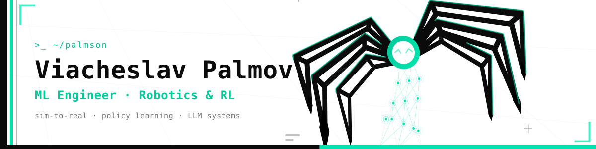

<div align="center">



<br>


<br><br>

[](mailto:codesldr@gmail.com)
[](#)

</div>

---

```python
class MLEngineer:
    def __init__(self):
        self.name     = "VIACHESLAV PALMOV"
        self.role     = "ML Engineer · Robotics & Reinforcement Learning"
        self.focus    = ["policy learning", "sim-to-real", "imitation learning"]
        self.building = "an 18-DoF hexapod that learns to walk"
        self.now      = "robotics test engineer → ML engineering"

    def philosophy(self) -> str:
        return "The best moment is when the thing you built finally does something."
```

---

## ▚ About

ML Engineer in Robotics.
I train control policies in simulation and bring them to **real hardware**, and I build applied
systems on top of large language models.

- Trained an RL locomotion policy for a self-built hexapod and validated it on the physical robot
- Fine-tuned transformers (TrOCR) and shipped quantized LLMs that run fully offline
- Currently working with real robots while moving deeper into ML engineering

---

## ▚ Featured Projects

<table>
<tr>
<td width="50%" valign="top">

### ⬢ [Hexapod Locomotion RL](https://github.com/palmson/hexapod-rl)

An 18-DoF six-legged robot learns to walk from scratch in MuJoCo using **PPO + Intrinsic Curiosity**.
Custom robot model, custom Gymnasium environment, and a four-gait comparison on real hardware
measuring energy and stability.

`MuJoCo` `PyTorch` `SB3` `PPO` `ICM`

</td>
<td width="50%" valign="top">

### ⬢ [TrOCR · Handwritten Cyrillic](https://github.com/Palmson/Text-recognition)

Fine-tuned Microsoft TrOCR with partial encoder freezing for handwriting recognition.
Mixed precision, gradient accumulation, int8 quantization for CPU inference.

`PyTorch` `HuggingFace` `Transformers`

</td>
</tr>
<tr>
<td width="50%" valign="top">

### ⬢ Autonomous Browser Agent

An LLM agent with its own tool set: parses interactive page elements, then plans and executes
tasks with no predefined path.

`Python` `LLM` `Agents`

</td>
<td width="50%" valign="top">

### ⬢ Local-Model Form Autofill

Pulls data from text and screenshots, fills forms per instruction. Fully local quantized model
behind a browser extension.

`llama.cpp` `GGUF` `Local LLM`

</td>
</tr>
</table>

---

## ▚ Stack

<div align="center">


</div>

**ML / RL** · PyTorch · Stable-Baselines3 · PPO · intrinsic motivation · transformer fine-tuning · CNNs

**Simulation & Robotics** · MuJoCo · Gymnasium · Brax/JAX · ROS2 · kinematics · microcontrollers

**Engineering** · Python · C/C++ · Kotlin · Docker · CI/CD · Linux

---

<div align="center">
<sub><code>open to opportunities in ML engineering &amp; robotics</code></sub>


</div>


<!--
**Palmson/Palmson** is a ✨ _special_ ✨ repository because its `README.md` (this file) appears on your GitHub profile.

Here are some ideas to get you started:

- 🔭 I’m currently working on ...
- 🌱 I’m currently learning ...
- 👯 I’m looking to collaborate on ...
- 🤔 I’m looking for help with ...
- 💬 Ask me about ...
- 📫 How to reach me: ...
- 😄 Pronouns: ...
- ⚡ Fun fact: ...
-->
